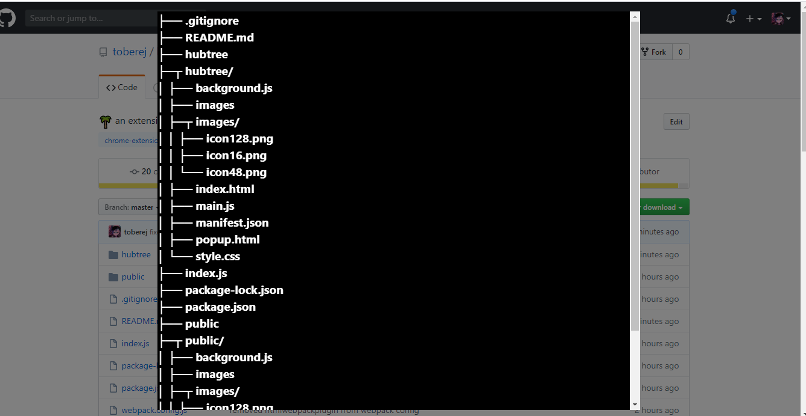

<h1 align="center">🌴 hubtree</h1>
<p align="center"> A chrome extension to view the directory tree of a github repository. </p>
<p align="center">
  
</p>

### Motivation:
Seeing directory structure:
- Better learning and understanding

### Installation Options:
1) **Chrome Webstore:** COMING SOON
2) **Manual Install:**
    -  Download/Clone the project
    - In your chrome address bar type: chrome://extensions
    - In the upper left turn on Developer Mode
    - Click load unpacked in the upper right corner
    - Select the hubtree folder that is contained **within** the project directory

### Usage
- Click the extension icon when in a github repsitory to show/hide the tree modal

### Development
```
npm install 
```
When done making changes:
```
npm run build
```
Then load to chrome in developer mode or reload the extension if it has already been loaded in chrome. 

If there is a more efficient way to do this [let me know](https://twitter.com/toberej)

### Todos
- [ ] Add links to directory tree
- [ ] Make the modal less terrible looking
- [ ] Possibly save tree in storage (session or chrome.storage) to minimize requests if opening the modal multiple times in the same repository
- [ ] Show message in modal when not in or can't find a repository, or don't show the modal in these cases (notification maybe ?).

### Contact
DM on twitter [here](https://twitter.com/toberej)

